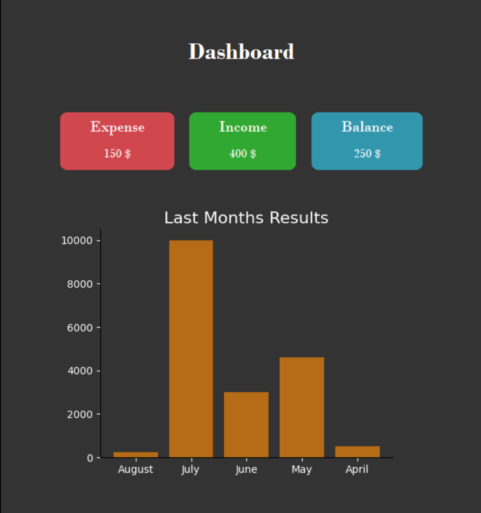

# Savvy
A simple Python desktop app to track revenues and expenses, generate financial plans, and receive analysis via Groq API.


## Overview
Savvy is a clean and simple desktop application that helps users manually track revenues and expenses, manage financial plans, and get personalized advice via the Groq API. The dashboard provides a quick overview of the balance over the last 5 months, along with key metrics for expenses, revenue, and net balance.


## Features
- Add, edit, and categorize revenue and expense entries.
- Create financial plans with custom names and descriptions.
- Generate personalized advice and analysis based on your plan history via Groq API.
- Dashboard showing:
  - A chart of net balance over the last 5 months.
  - Three key cards: Expenses, Revenue, Balance.
- Lightweight desktop interface using Tkinter.
- Data stored locally using SQLite3.


## Tech Stack
- Python
- Flask (for backend/API interaction)
- Tkinter (for GUI)
- SQLite3 (for local database)
- Groq API (for financial advice)

## Installation

1. Clone the repository:
```bash
git clone https://github.com/Youssef1238/Savvy.git
cd savvy
```
2. Install dependencies:
```bash
pip install -r requirements.txt
```

3. Get a Groq API Key and add it to .env in the backend along with a jwt_secret:
```bash
JWT_SECRET_KEY="XXXXXXXXXXXXXXX"
GROQ_API_KEY="XXXXXXXXXXXXXXXXXXXXXXXXXXX"
```

4. Run the backend server first:
```bash
python main.py
```

5. Add the server url to the .env file:
```bash
API_URL='http://127.0.0.1:PORT/'
```

5. Run the frontend app:
```bash
python main.py
```

## Usage
1. Launch the app.
2. Add revenue and expense entries, including category and amount.
3. Create a financial plan by giving it a name and description.
4. Generate advice based on your plans and historical entries.
5. Check the dashboard to view a chart of your balance over the last 5 months and key metrics.

## Screenshots

